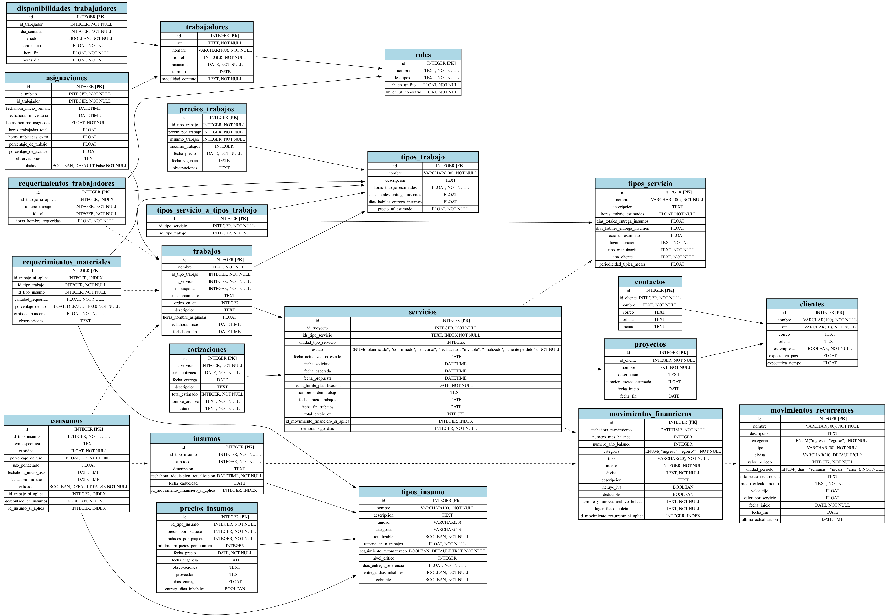

# OperaIQ – Simulador y Generador de Base de Datos Operativa

**OperaIQ** es una herramienta para simular la operación de una empresa de servicios, generando una base de datos estructurada con reglas lógicas de negocio. Está diseñada para reproducir escenarios realistas y servir como base de análisis, reportería, visualización y pruebas de modelos de optimización.

---

## 📌 Características principales

- Generación reproducible de datos con lógica realista
- Modelado completo de trabajadores, insumos, clientes, servicios, roles, cotizaciones y más
- Simulación de flujo temporal de eventos con reglas predefinidas
- Exportación del modelo ERD como imagen
- Modularización del código con uso de `peewee` y configuración por `.env`

---

## 🧠 Estructura general del proyecto

```text
operaiq_simulador/
│
├── scripts/                # Scripts principales de ejecución paso a paso
├── src/                    # Módulos reutilizables: modelos, conexión, utils, constantes
├── contenido_tablas/       # CSV generados automáticamente
├── inputs/                 # Archivos .json con parámetros de entrada
├── logs/                   # Archivos de log del proceso
├── erd/                    # Imagen del modelo entidad-relación
├── docs/                   # Documentación detallada en PDF y DOCX
├── .env.example            # Variables de entorno de ejemplo
├── README.md               # Este archivo
└── requirements.txt        # Modulos de python necesarios
```

## 🖼️ Diagrama ERD


## ⚙️ Requisitos

- Python 3.9 o superior

- Paquetes: ver requirements.txt

- No requiere una base de datos preexistente: toda la información se genera y simula localmente

- Graphviz (sistema): además del paquete graphviz de Python, se requiere tener instalado Graphviz en el sistema operativo para poder generar el diagrama ERD como imagen.

Puedes instalarlo con:

En Ubuntu/Debian:

```bash
sudo apt-get install graphviz
```

En Mac (con Homebrew):

```bash
brew install graphviz
```

En Windows: Descárgalo desde https://graphviz.org/download/ y asegúrate de agregarlo al PATH.

## 🚀 Cómo usar

### **1. Clona este repositorio:**

```bash
git clone https://github.com/fsantanar/operaiq_simulador.git
cd operaiq_simulador
```

### **2. Instala las dependencias:**

Asegúrate de tener Python 3.9 o superior y luego instala los paquetes requeridos:


```bash
pip install -r requirements.txt
```

### **3. Configura tus variables de entorno a partir de .env.example**

Crea un archivo .env basado en el archivo de ejemplo:

```bash
cp .env.example .env
```

Y luego asigna valores reales para el nombre de la base de datos, el usuario, y la clave.


### **4. Corre los scripts en orden desde scripts/db01_...py hasta scripts/db07_...py**

Ejecuta los scripts en orden (por ejemplo desde la carpeta base con)

```bash
python scripts/db01_crea_base_de_datos.py
python scripts/db02_crea_tablas.py
python scripts/db03_crea_erd.py
python scripts/db04_crea_csvs_para_tablas_base.py
python scripts/db05_llena_tablas_base.py
python scripts/db06_crea_instancias_tablas.py
python scripts/db07_revisa_cargas.py
```


## 📄 Documentación
Consulta los siguientes archivos en la carpeta docs/:

📘 [Documentación de la base de datos](docs/documentacion_base_de_datos.pdf)

📗 [Reglas y Simplificaciones](docs/reglas_y_simplificaciones.pdf)

## 📬 Contacto
Proyecto desarrollado por Felipe Santana
✉️ contacto: fsantanar@gmail.com

## 📝 Licencia
Este proyecto no cuenta actualmente con una licencia de uso. Para uso comercial o redistribución, contactar al autor
