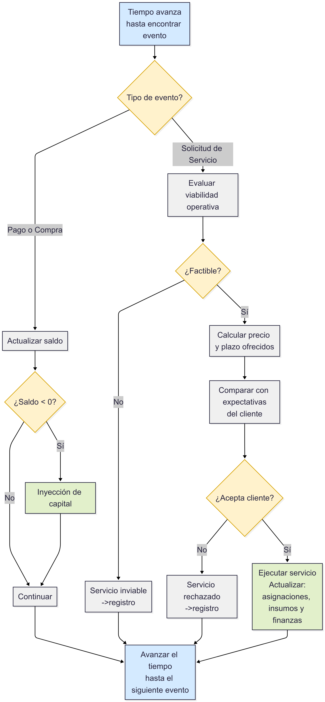
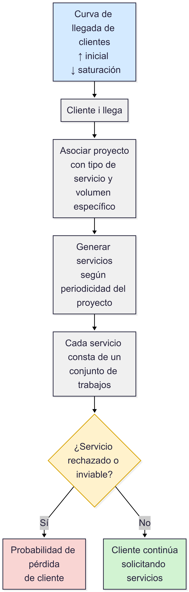
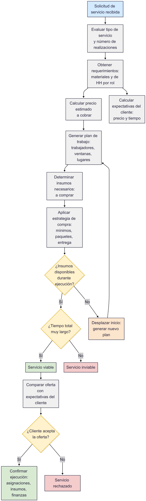

[](https://github.com/fsantanar/operaiq_simulador/actions)


# OperaIQ – Simulador y Generador de Base de Datos Operativa

**OperaIQ** es una herramienta para simular la operación de una empresa de servicios, generando una base de datos estructurada con reglas lógicas de negocio. Está diseñada para reproducir escenarios realistas y servir como base de análisis, reportería, visualización y pruebas de modelos de optimización. También crea la base de datos necesaria para la contraparte online de esta herramienta presentada en https://github.com/fsantanar/operaiq

---

## 📌 Características principales

- Generación reproducible de datos con lógica realista.
- Modelado simultaneo de trabajadores, insumos, clientes, servicios, roles, cotizaciones y más.
- Simulación de flujo temporal de eventos con reglas predefinidas.
- Generación de base de datos para usar como input en herramientas online.
- Modularización del código con uso de `peewee` y configuración por `.env`.

---

## 🧠 ¿Cómo funciona OperaIQ?

OperaIQ genera una base de datos operativa simulando el comportamiento de una empresa real de servicios. A través de un conjunto de reglas dinámicas y configurables, modela clientes, proyectos, cotizaciones, tiempos de entrega, disponibilidad de trabajadores, compras de insumos y asignaciones laborales, todo basado en decisiones controladas y variables que se actualizan en el tiempo.

<h3 align="center">🗺️ Diagrama general del sistema</h3>

<p align="center">
  
</p>

🔄 El tiempo avanza día a día simulando eventos como:
- Llegada o pérdida de clientes.
- Solicitudes de servicios.
- Compra de insumos y asignación de recursos.
- Asignaciones de horas de trabajo a trabajadores según disponibilidad
- Aceptación/Rechazo servicios por parte del cliente según precio y duración de los trabajos.
- Ejecución de servicios, consumos y pagos.

📊 Este enfoque permite:
- Evaluar escenarios.
- Detectar cuellos de botella.
- Validar estrategias laborales, de planificación o abastecimiento.

---

## 🔬 Lógica y algoritmos destacados

OperaIQ no se limita a rellenar tablas con datos aleatorios. Utiliza reglas realistas y técnicas avanzadas para simular decisiones bajo incertidumbre. Algunos ejemplos:

### 🧮 Optimización bajo incertidumbre
Los datos de entrada se separan en:
- Observacionales (medidos directamente)
- Latentes (reglas ocultas inferidas, como aceptación de ofertas)
- De decisión (estrategias empresariales como a qué proveedor comprar)

Esto permite:
- Medir sensibilidad de resultados a cambios en reglas o incertidumbres.
- Proponer mejoras robustas en decisiones operativas.

### 🧩 Generación de Clientes y Servicios

La simulación considera una curva de llegada de clientes que crece rápidamente al inicio y se desacelera al saturarse el mercado. Cada cliente trae asociado un proyecto que define un tipo de servicio (único o periódico), el cual a su vez determina un conjunto de trabajos operativos. Los servicios rechazados o inviables afectan la probabilidad de que el cliente siga solicitando servicios, introduciendo una lógica de retención basada en resultados.

<h3 align="center">🗺️ Diagrama clientes y servicios</h3>

<p align="center">
  
</p>


### 📦 Compra de insumos
El sistema calcula combinaciones posibles de compras considerando:
- Disponibilidad de stock, considerando tanto el stock físico total como el stock operativo disponible, es decir, descontando los insumos ya comprometidos en consumos futuros.
- Requisitos materiales de cada trabajo involucrado en el servicio.
- Tiempo de entrega (en días hábiles o corridos).
- Promociones por volumen, precio por paquete y mínimos por compra.
- Criterio económico: menor costo total, menor precio por unidad, menor demora, etc.


### 👷 Planificación de servicios
Cada servicio es descompuesto en trabajos → asignaciones → ventanas temporales, buscando:
- Cumplir con los requisitos de horas necesarias por rol para el servicio, ya sea para labores realizadas
en conjunto o por trabajadores individuales.
- Asignar trabajos a trabajadores disponibles sin superposición, basado en sus horarios y cargas.
- Minimizar lagunas de inactividad y duración total de la ejecución.
- Asegurar disponibilidad de lugares de trabajo para todo el servicio.
- Asegurar que todos los insumos necesarios estén disponibles al momento de iniciar el servicio y durante toda su ejecución.

<h3 align="center">🗺️ Diagrama planificación de servicios</h3>

<p align="center">
  
</p>

### 📈 Simulación de flujo temporal
Cada día se simulan eventos: solicitudes, entregas, compras, cotizaciones, etc.
Las reglas se ejecutan en orden cronológico, manteniendo consistencia y trazabilidad entre decisiones y resultados.
Cada evento modifica datos como la carga de los trabajadores, la disponibilidad de los insumos, los estados de los servicios
o trabajos, la llegada o salida de clientes y los movimientos financieros.
En todo momento se asegura que no hayan inconsistencias como asignaciones laborales traslapantes, uso de insumos no disponibles o trabajos mal definidos. Además se monitorea en todo momento el saldo financiero disponible, asegurandose que haya saldo suficiente para realizar cualquier actividad que involucre gasto, y en caso contrario forzando una inyección de capital que permita continuar las operaciones.

---

## 🎯 ¿Por qué OperaIQ es diferente?

OperaIQ no es solo una base de datos generada al azar. Es un motor de simulación operativa con fundamentos en optimización discreta, diseño de reglas bajo incertidumbre y modelado algorítmico de procesos reales. Su diseño permite representar con precisión decisiones secuenciales, restricciones operativas y dependencias temporales, habilitando análisis que van mucho más allá de la simple generación de registros.

🔧 **Técnicas y enfoques destacados:**

- Separación explícita de variables en categorías **observacionales, latentes y de decisión**, permitiendo aplicar estrategias robustas de simulación bajo incertidumbre y análisis de sensibilidad paramétrica.

- Implementación de lógica de planificación basada en **restricciones temporales y de recursos**, simulando ventanas de disponibilidad, precedencias de tareas y compatibilidades entre elementos.

- Lógica de abastecimiento que evalúa **espacios factibles de compra** considerando stock físico, stock operativo (descontando consumos futuros) y restricciones de compra mínima y tiempo de entrega, resolviendo una instancia simplificada del problema de selección de proveedores.

- Mecanismo de asignación de trabajadores inspirado en técnicas de **búsqueda heurística con validación por restricciones**, evaluando múltiples soluciones candidatas y seleccionando la más factible dado el calendario de recursos y los márgenes temporales definidos.

- Evaluación de propuestas comerciales mediante una función de aceptación estocástica dependiente de múltiples dimensiones (precio y plazo), lo que permite simular la **probabilidad conjunta de éxito** de una oferta bajo escenarios de elasticidad del cliente.

- Registro en logs y trazabilidad detallada de todas las decisiones tomadas por el sistema, permitiendo construir sobre esta base módulos futuros de optimización, análisis causal o aprendizaje de políticas.

Este enfoque permite construir no solo una base de datos, sino una **infraestructura de decisión simulada**, extensible hacia aplicaciones reales de gestión, control y análisis predictivo.

---

## 🧠 Estructura general del proyecto

```text
operaiq_simulador/
│
├── scripts/                # Scripts principales de ejecución paso a paso
├── src/                    # Módulos reutilizables: modelos, conexión, utils, constantes
├── contenido_tablas/       # CSV generados automáticamente
├── inputs/                 # Archivos .json con parámetros de entrada
├── logs/                   # Archivos de log del proceso
├── erd/                    # Imagen del modelo entidad-relación
├── docs/                   # Documentación detallada en PDF y DOCX
├── .env.example            # Variables de entorno de ejemplo
├── README.md               # Este archivo
└── requirements.txt        # Modulos de python necesarios
```

---

## 🖼️ Diagrama ERD

El siguiente esquema muestra el diagrama relacion-entidad con todas las tablas con sus campos
y relaciones foraneas que las conectan.


---

## ⚙️ Requisitos

- Python 3.11 o superior

- Paquetes: ver requirements.txt

- No requiere una base de datos preexistente: toda la información se genera y simula localmente

- Graphviz (sistema): además del paquete graphviz de Python, se requiere tener instalado Graphviz en el sistema operativo para poder generar el diagrama ERD como imagen.

Puedes instalarlo con:

En Ubuntu/Debian:

```bash
sudo apt-get install graphviz
```

En Mac (con Homebrew):

```bash
brew install graphviz
```

En Windows: Descárgalo desde https://graphviz.org/download/ y asegúrate de agregarlo al PATH.

---

## 🚀 Cómo usar

### **1. Clona este repositorio:**

```bash
git clone https://github.com/fsantanar/operaiq_simulador.git
cd operaiq_simulador
```

### **2. Instala las dependencias:**

Asegúrate de tener Python 3.11 o superior y luego instala los paquetes requeridos:


```bash
pip install -r requirements.txt
```

### **3. Configura tus variables de entorno a partir de .env.example**

Crea un archivo .env basado en el archivo de ejemplo:

```bash
cp .env.example .env
```

Luego abre tu nuevo archivo .env y reemplaza los valores de ejemplo por los reales:

```env

# Base de datos del proyecto
DB_NAME=operaiq_simulador

# Usuario para que sea dueño de la nueva base de datos con su clave asociada.
# Si eliges un usuario nuevo se creará con la clave que indiques acá.
# Si quieres usar un usuario existente simplemente usa su nombre como DB_USER y se
# mantendrá su clave actual (los códigos no modifican usuarios existentes).
# Solo asegurate de que el usuario existente cuente con clave o que tu archivo pg_hba
# le permita conectarse a la base sin clave con una linea como:
# local   operaiq_simulador  usuario_existente              trust
DB_USER=usuario
DB_PASSWORD=clave_usuario

# Usuario administrador (por defecto llamado postgres) con permisos para crear bases de datos y usuarios.
# DB_ADMIN_PASSWORD debe llevar la clave de este usuario administrador.
# La base puede ser la que viene por defecto (generalmente llamada postgres) o cualquier a la que tenga
# acceso el usuario administrador
DB_ADMIN_USER=postgres
DB_ADMIN_PASSWORD=clave_superusuario
DB_ADMIN_DB=postgres

# Host y puerto de conexión
# Estos puedes dejarlos como están si no quieres personalizarlo
DB_HOST=localhost
DB_PORT=5432


# Finalmente cambia este boolean a true si quieres que las pruebas de GitHub actions
# incluyan los dos ultimos scripts que demoran alrededor de 10 minutos.
RUN_FINAL_SCRIPTS=true
```


### **4. Corre los scripts en orden desde scripts/db01_...py hasta scripts/db07_...py**

Ejecuta los scripts en orden (por ejemplo desde la carpeta base con)

```bash
python scripts/db01_crea_base_de_datos.py
python scripts/db02_crea_tablas.py
python scripts/db03_crea_erd.py
python scripts/db04_crea_csvs_para_tablas_base.py
python scripts/db05_llena_tablas_base.py
python scripts/db06_crea_instancias_tablas.py
python scripts/db07_revisa_cargas.py
```

---

## 🔭 Ideas de Extensión Futura

OperaIQ está construido como una herramienta adaptable y extensible. Gracias a su arquitectura modular y su lógica bien estructurada, puede fácilmente ampliarse en múltiples direcciones para cubrir una operación real con mayor profundidad o complejidad.

Estas son algunas de las extensiones planificadas o proyectadas:

- 🧾 **Órdenes de Compra**  
  Generación automática de órdenes de compra a partir de requerimientos de insumos, considerando stock, tiempos de entrega y condiciones de compra por volumen.

- 🛒 **Asistente de Compras**  
  Motor inteligente que recomienda qué insumos comprar, en qué cantidades y a qué proveedor, optimizando el costo total y el tiempo de reposición.

- 🛠️ **Órdenes de Trabajo**  
  Consolidación de trabajos en órdenes operativas por cliente o por proyecto, permitiendo control de ejecución y reportabilidad detallada.

- 🗓️ **Fechas Clave**  
  Registro y visualización de hitos importantes como fechas de solicitud, entrega estimada, pagos y mantenimiento futuro.

- 🧠 **Recomendaciones Inteligentes**  
  Motor de sugerencias para la toma de decisiones, basado en patrones históricos, cuellos de botella detectados, o simulaciones previas exitosas.

- 🧑‍💼 **Gestión de RRHH**  
  Seguimiento avanzado de trabajadores, incluyendo carga laboral, disponibilidad futura, desempeño e indicadores de eficiencia.

- 🗃️ **Administración de Bodega**  
  Visualización del stock disponible, productos próximos a caducar, y alertas automáticas por insumos críticos.

- 📋 **Tablero de Pendientes**  
  Panel de control de servicios y trabajos en espera de confirmación, planificación o ejecución, con filtros y alertas.

- 📈 **Indicadores Estratégicos**  
  Dashboard de KPIs personalizados, como margen promedio por servicio, cumplimiento de fechas, utilización de recursos y más.

- 📚 **Historial de Servicios**  
  Registro completo de servicios prestados, incluyendo cotizaciones, asignaciones, consumos, resultados y retroalimentación del cliente.

- 📣 **Marketing Inteligente**  
  Sistema que analiza historial de clientes y servicios para recomendar ofertas, avisos de mantenimiento y campañas personalizadas.

- ⚙️ **Simulación Automatizada de Servicios**  
  Motor que permite replanificar servicios automáticamente ante cambios en condiciones (retrasos, cambios de stock, ausencia de personal), maximizando cumplimiento y eficiencia.

---

Estas extensiones permiten que OperaIQ evolucione desde un generador de base de datos hacia una **plataforma de gestión inteligente de operaciones**, adaptable a distintas industrias y escalable a escenarios reales.


## 📄 Documentación Extra
Consulta los siguientes archivos en la carpeta docs/:

📘 [Documentación de la base de datos](docs/documentacion_base_de_datos.pdf)

📗 [Reglas y Simplificaciones](docs/reglas_y_simplificaciones.pdf)

## 📬 Contacto
Proyecto desarrollado por Felipe Santana
✉️ contacto: fsantanar@gmail.com

## 📝 Licencia
Este proyecto no cuenta actualmente con una licencia de uso. Para uso comercial o redistribución, contactar al autor
